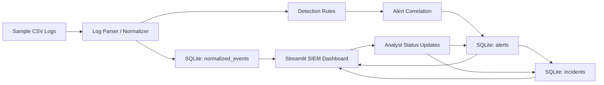

# SOC/SIEM Threat Detection and Monitoring Prototype

A local SOC/SIEM threat detection and monitoring prototype built with Python, Streamlit, SQLite, Pandas, and Plotly.

This project is designed for students and portfolio use. It demonstrates practical blue-team workflows in a beginner-friendly way without claiming enterprise-scale capability.

## Why this project exists
This project helps you explain a realistic SOC/SIEM pipeline in interviews:
- how logs are ingested and normalized
- how detections are applied
- how alerts are correlated and stored
- how analysts investigate alerts and manage incidents

## Technology Stack
- Python
- Streamlit (dashboard)
- SQLite (local persistence)
- Pandas (data processing)
- Plotly (visualizations)
- Python `re` (pattern-based detections)

## Architecture


## Project Structure
```text
soc-threat-detection/
├── app.py
├── requirements.txt
├── README.md
├── .gitignore
├── data/
│   └── sample_logs/
├── ingestion/
│   └── log_parser.py
├── detection/
│   ├── detection_engine.py
│   ├── rules.py
│   └── mitre_mapping.py
├── database/
│   └── database.py
├── dashboard/
│   └── analytics.py
├── models/
│   └── schemas.py
└── tests/
```

## Log Ingestion
- Uses local sample CSV logs from `data/sample_logs/`
- Supported sample sources include authentication, web, and network events
- Current source tagging:
  - sample logs use `source_type = "sample"`
  - architecture is ready to preserve alternative dataset tags if provided (for example `cic-ids2017`)

## Normalization
Logs are normalized into a common event schema with core fields:
- `timestamp`
- `source_ip`
- `destination_ip`
- `username`
- `event_type`
- `action`
- `status`
- `message`
- `source`
- `source_type`

## Detection Engine
Implemented beginner-friendly rule-based detections:
- Brute Force Login
- Multiple Failed Login Attempts
- Suspicious Login
- SQL Injection Indicators
- Port Scanning Indicators
- Excessive HTTP Requests
- Suspicious URL Pattern

Each detection returns structured alerts containing rule name, severity, confidence, description, MITRE technique (when mapped), and evidence when available.

## Severity Logic
Severity uses the levels:
- LOW
- MEDIUM
- HIGH
- CRITICAL

Count-based rules now pass their detection counts into severity classification so thresholds are applied consistently.

## Alert Correlation
Correlation groups alerts when they share:
- source IP
- username
- event type
- nearby timestamps within a configurable window

When a valid group is found, the correlated alerts are marked and severity is increased one level (up to CRITICAL).

## MITRE ATT&CK Mapping (Implemented Only)
- Brute Force Login → T1110
- Multiple Failed Login Attempts → T1110
- Suspicious Login → T1078
- SQL Injection Indicators → T1190
- Port Scanning Indicators → T1046
- Excessive HTTP Requests → T1499
- Suspicious URL Pattern → T1190

This is intentionally limited to techniques used by implemented rules.

## SQLite Persistence
Tables:
- `normalized_events`
- `alerts`
- `incidents`

The database layer keeps persistence concerns separate from detection logic and includes safe schema initialization/upgrade behavior.

## Duplicate Ingestion Prevention
Clicking **Ingest Sample Logs** repeatedly no longer creates duplicate rows.

How it works:
- each normalized event gets a deterministic `event_hash`
- each alert gets a deterministic `alert_fingerprint`
- SQLite unique indexes plus `INSERT OR IGNORE` make ingestion idempotent for repeated identical input

This prevents accidental duplicate events/alerts without deleting the database.

## Streamlit SIEM Dashboard
The dashboard provides:
- SOC-style dark theme
- SIEM KPI overview cards
- charts for severity, time, rule, MITRE technique, source IPs, event source, incident status
- recent alerts table
- suspicious IP summary
- alert investigation panel (with evidence when present)
- incident status workflow: Open, Investigating, Resolved, False Positive

## Incident Management
Analysts can update alert status in the dashboard.
Status updates persist in SQLite and keep `alerts` and `incidents` records consistent.

## Run Locally
```bash
python -m venv .venv
source .venv/bin/activate
pip install -r requirements.txt
streamlit run app.py
```

## Testing
Run tests:
```bash
pytest tests -q
```

## Limitations
- Local prototype only (not a production enterprise SIEM)
- Uses simulated/sample logs
- Rule-based detections can produce false positives/negatives
- Correlation logic is intentionally simple and explainable
- SQLite is single-node local storage

## Future Improvements
- Add additional parsers and datasets
- Add baseline/anomaly scoring per user/IP
- Add richer incident timelines and case notes
- Add exportable SOC investigation reports
- Add configurable rule thresholds in UI
