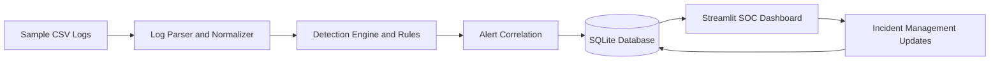

# SOC Threat Detection and Monitoring Platform

A beginner-friendly but realistic SOC (Security Operations Center) project that ingests logs, detects suspicious behavior, generates alerts, maps detections to MITRE ATT&CK techniques, stores data in SQLite, and visualizes everything in Streamlit.

## Problem Statement
Build a local SOC platform that demonstrates core blue-team workflows:
- log ingestion
- normalization
- rule-based detections
- alert generation
- incident tracking
- dashboard monitoring

This project is intentionally designed for students and portfolio use, so each component is explainable during interviews.

## Features
- CSV log ingestion for authentication, web, and network events
- Reusable normalization parser for a common schema
- Rule-based threat detections:
  - Brute Force Login
  - Multiple Failed Login Attempts
  - Suspicious Login
  - SQL Injection Indicators
  - Port Scanning Indicators
  - Excessive HTTP Requests
  - Suspicious URL Pattern
- Alert scoring with severity and confidence
- Local MITRE ATT&CK mapping (limited, explicit coverage)
- SQLite storage for normalized events, alerts, and incidents
- Simple alert correlation by source IP/time window
- Streamlit SOC dashboard with filters, charts, and incident status updates
- Unit tests for parser and core detection logic

## Architecture (Mermaid)


## Technology Stack
- Python
- Streamlit
- SQLite
- Pandas
- Plotly
- Python `re` (regular expressions)

## Project Structure
```text
soc-threat-detection-platform/
│
├── app.py
├── requirements.txt
├── README.md
├── .gitignore
│
├── data/
│   └── sample_logs/
│
├── database/
│   └── database.py
│
├── detection/
│   ├── detection_engine.py
│   ├── rules.py
│   └── mitre_mapping.py
│
├── ingestion/
│   └── log_parser.py
│
├── models/
│   └── schemas.py
│
├── tests/
│   ├── test_parser.py
│   └── test_detection.py
│
└── screenshots/
```

## Installation
```bash
python -m venv .venv
source .venv/bin/activate
pip install -r requirements.txt
```

## Run the Application
```bash
streamlit run app.py
```

1. Click **Ingest Sample Logs** in the sidebar.
2. Review metrics and visualizations.
3. Filter by severity, detection type, source IP, and date.
4. Update incident status (Open, Investigating, Resolved, False Positive).

## Example Detection
Input event message:
```text
/login.php?id=1 OR 1=1
```
Detection result:
```text
Rule: SQL Injection Indicators
Severity: HIGH
MITRE Technique: T1190
```

## Example Alert (Structured)
```json
{
  "alert_id": "uuid",
  "timestamp": "2026-10-03 08:21:00",
  "rule_name": "SQL Injection Indicators",
  "event_type": "web",
  "source_ip": "203.0.113.15",
  "username": "",
  "severity": "HIGH",
  "confidence": 0.92,
  "description": "Request contains SQL injection pattern ...",
  "mitre_technique": "T1190",
  "status": "Open"
}
```

## MITRE ATT&CK Mapping (Implemented Rules Only)
- Brute Force Login → T1110
- Multiple Failed Login Attempts → T1110
- Suspicious Login → T1078
- SQL Injection Indicators → T1190
- Port Scanning Indicators → T1046
- Excessive HTTP Requests → T1499
- Suspicious URL Pattern → T1190

> This project does **not** claim complete MITRE ATT&CK coverage.

## Testing
Run unit tests:
```bash
pytest tests -q
```

## Limitations
- Uses sample/simulated logs only (not enterprise telemetry scale)
- Rule-based detections can produce false positives/negatives
- Correlation logic is intentionally simple
- Local SQLite storage (single-node)

## Future Improvements
- Add geolocation-aware login anomaly checks
- Add user/entity baselines
- Introduce scheduled ingestion jobs
- Add richer incident case management workflow
- Add export/reporting options for analysts
